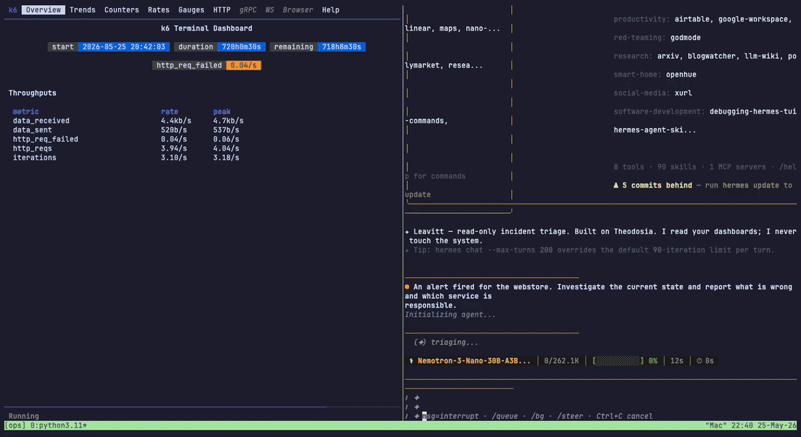
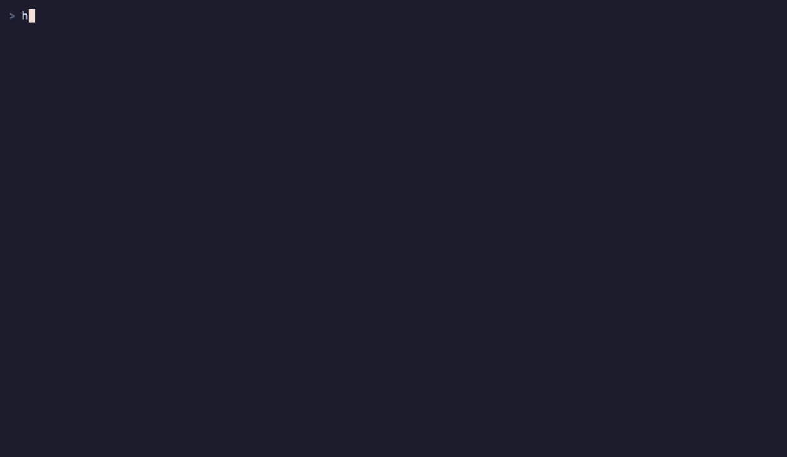
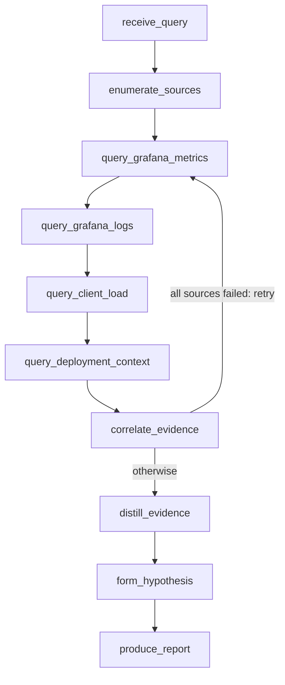

# Leavitt

Leavitt is an incident-triage agent that reads observability dashboards and tells you what broke, without touching anything. It ships as a **Hermes agent running NVIDIA Nemotron on Crusoe Cloud managed inference**, and runs as a standalone terminal app.

**Built on [Theodosia](https://github.com/msradam/theodosia).** Theodosia mounts a Burr state machine as an MCP server and enforces every transition. Leavitt is the state machine: a read-only triage workflow an LLM drives one validated step at a time. It cannot run commands, open shells, or modify the systems it observes. The read-only guarantee is structural, the graph contains only read actions and no path to a write.

The Leavitt agent (below, Nemotron via Crusoe) triaging a live incident, with a live view of the k6 client load it is reading (above):



## What it does

You give Leavitt an incident question. It reads metrics, logs, client-side load results, and deployment context from real observability backends through MCP servers, correlates what came back, notes what is missing, and produces a triage report with a disposition constrained by the evidence, not by the model's confidence.

```
$ leavitt investigate "An alert fired for the webstore. Root cause?"

disposition:       resolved
confidence:        full
root cause:        llmRateLimitError feature flag is rate-limiting the product-reviews
                   service, cascading to frontend and recommendations
affected services: product-reviews, frontend, recommendations
sources usable:    4/4 (grafana_metrics, grafana_logs, client_load, deployment_context)
```

When a source goes down mid-investigation, Leavitt continues with what it has and marks the report `degraded`. When nothing usable comes back, it refuses to conclude `resolved` and returns `inconclusive`. It does not invent evidence, and it does not claim a resolution it cannot support.

## Ships as a Nemotron agent on Crusoe

Leavitt is an MCP server, so any agent can drive it. It ships as a [Hermes](https://github.com/NousResearch/hermes-agent) agent profile running **NVIDIA Nemotron on Crusoe Cloud managed inference**: Hermes connects to the Leavitt MCP and Nemotron drives the enforced FSM to a triage report. The agent is Leavitt; Hermes is the outer harness, Theodosia the inner one. Two governance layers on one Nemotron agent, Hermes sandboxes what the agent can touch, Theodosia enforces the workflow it must follow.



```
Hermes agent (Nemotron via Crusoe)  ──MCP──>  Leavitt (Theodosia step surface)  ──>  telemetry
        outer harness                            inner harness (FSM enforcement)
```

The driver never reaches the dashboards. The upstream connections and credentials live in the Leavitt server, and Nemotron sees only the `step` tool, so no driver, however capable, can touch the observed system except by asking Leavitt to read it. Install and run it as a branded Hermes profile: [`deploy/hermes/`](deploy/hermes/).

## Architecture

The FSM, enforced by Theodosia:



The four read sources:

- `query_grafana_metrics` — PromQL via mcp-grafana, server-side error rate by service
- `query_grafana_logs` — LogQL via mcp-grafana, warning and error logs
- `query_client_load` — k6 client-side failure rate per endpoint, the user-facing symptom
- `query_deployment_context` — current feature-flag state, what changed

`correlate_evidence` counts coverage and marks confidence, with one recovery edge: when every source fails it loops back to re-query before giving up. `distill_evidence` reduces raw telemetry to a high-signal digest before `form_hypothesis`. `produce_report` is terminal; `resolved` requires full source coverage and a cause grounded in the observed signal.

- Every action is read-class. There is no write action and no unlock edge, so the driver cannot act on the observed system or skip `correlate_evidence` to jump to a conclusion. Theodosia refuses any invalid transition.
- Upstream MCP servers (`mcp-grafana`, a feature-flag context server) are never exposed to the driver. Each query happens inside an action via `theodosia.call_upstream`, so it advances state by construction and lands in the audit trail. The credentials and connections to the observed backends live in the Leavitt server, never in the driver, so no driver can reach the dashboards except by asking Leavitt to read them.
- Upstream failures are classified (`ok` / `error` / `malformed`) before they reach correlation, so one bad source cannot poison the report.


## Install

```bash
uv sync
```

Requires Python 3.11+. The reasoning model is Kimi K2.6 via litellm (`together_ai/moonshotai/Kimi-K2.6`), configurable with `LEAVITT_LLM`. Set `TOGETHER_API_KEY` in `.env`.

## The substrate

Leavitt observes the [OpenTelemetry Demo](https://github.com/open-telemetry/opentelemetry-demo), 15+ instrumented microservices with a `flagd` feature-flag service that injects named failures on demand. Logs flow to Loki and metrics to Prometheus, queried through `mcp-grafana`. Load is generated by k6, whose client-side metrics are a Leavitt source.

```bash
cd deploy && ./setup_demo.sh up      # demo + mcp-grafana + Loki + k6
export LEAVITT_GRAFANA_MCP=http://localhost:8000/sse
export LEAVITT_FLAGCTX_CONFIG=$PWD/opentelemetry-demo/src/flagd/demo.flagd.json
leavitt investigate "Users report product pages erroring. Root cause?"
```

## Benchmark

`bench/runner.py` runs each `flagd` failure scenario under three conditions: **clean** (all servers up), **single_down** (the deployment-context server is killed), and **multi_fail** (it is killed and the Grafana MCP server returns malformed data). Both arms are the same model driving via tool calls against the same servers and the same digested evidence. The only difference is the Theodosia layer: the **Leavitt** arm drives the enforced FSM with evidence-constrained disposition; the **baseline** calls the raw query tools and writes its own report, with no FSM. Ground truth is the demo's own `flagd` flag descriptions.

What it shows, honestly: with a capable model (Kimi K2.6) the two arms reach the same conclusions and neither produces a false positive. The benchmark measures that the enforcement layer costs nothing in accuracy while making the agent's behavior bounded and auditable, the disposition is constrained by evidence, every read is in the audit trail, and the failure mode under chaos is a degraded or inconclusive report rather than a confident wrong one. Full tables: [`demo/results_table.md`](demo/results_table.md).

## Resilient model layer

Leavitt's own LLM calls route through an OpenAI-compatible gateway with one env switch (`LEAVITT_LLM_API_BASE` / `LEAVITT_LLM_API_KEY`), validated with **TrueFoundry's AI Gateway**. Provider failover, retries, and load balancing happen at the gateway; Theodosia handles data-layer resilience (degraded or inconclusive reports when sources fail, never a confident wrong one). The model that drives the FSM and the model behind the gateway can differ; both are swappable. See [`deploy/integrations.md`](deploy/integrations.md).

## Audit trail

Every run is recorded through Theodosia's tracker. `leavitt sessions` lists past investigations, and `leavitt sessions <id>` shows the full trail: every step that ran, where it stopped, and the report. A session that stalled mid-FSM shows as `incomplete @ <action>` rather than as a wrong answer, the failure is visible, not silent. That is the auditability the read-only guarantee is for.

```
$ leavitt sessions
when                  query                    outcome                          steps
2026-05-25 23:11:..   alert fired, webstore    resolved  llmRateLimitError       10
2026-05-25 19:36:..   x                        incomplete @ receive_query         1
```

## Read-only by construction

Leavitt synthesizes observability information and never acts. That separation is the architecture, not a policy: the graph has nothing else in it, and the connection to the observed system lives only in the server.

## Name

Henrietta Swan Leavitt discovered the period-luminosity relation of Cepheid variable stars by reading photographic plates one at a time, which gave astronomy the cosmic distance ladder. Read the observations carefully, find the pattern, produce knowledge grounded in what the data shows.

## License

Apache 2.0.
