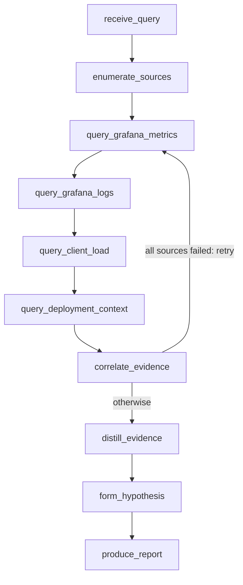

# Leavitt

**Title:** Leavitt: On-Call AI Agent, Turns Alerts Into Answers

**Tagline / elevator pitch:** Leavitt is an on-call AI agent that turns alerts into answers. It reads every
observability signal you have, metrics, logs, client-side load, and deployment
changes, correlates them, and pinpoints the root cause, staying honest about how
sure it is. Safe to leave running on production.

---

Leavitt diagnoses production incidents by reading your observability stack the
way a careful on-call engineer would, one source at a time, and reporting the
root cause with a confidence it can actually defend. It is built on Theodosia, a
state-machine runtime that keeps the reasoning on rails, so when the evidence is
thin it says so instead of inventing an answer.

## Inspiration

When something breaks in production, triage is a scramble across half a dozen
tools: error rates in Grafana, exceptions in the logs, failing requests in the
load tests, a feature flag someone flipped an hour ago. An on-call engineer
stitches it together at 3am. This reading and correlating is exactly what an
agent should be good at.

Two things stop you from trusting an agent with it. An agent that can act can
make the outage worse while you watch. And, more quietly, an LLM under pressure
invents a confident, plausible, wrong root cause and sends you down the wrong
path for an hour. The second failure is the one that actually burns on-call
teams, because it looks like an answer.

We wanted an agent that does the reading well, finds the real cause fast, and
tells the truth about how sure it is. That meant building the discipline into the
runtime instead of asking the model to be careful.

## What it does

You give Leavitt an incident question. It reads four observability sources
through MCP servers, server-side error rate (Prometheus), warning and error logs
(Loki), client-side failure rate (k6 load tests), and current feature-flag state,
correlates them, and reports what broke: the root cause, the affected services,
and the cascade between them. The interesting cases are the ones a human would
miss, an error that only shows up in the logs while the HTTP status stays 200,
or a flag flipped upstream of the symptom.

The conclusion is bounded by the evidence, not the model's confidence.
`resolved` only with full coverage and a cause grounded in the signal;
`degraded` when a source was lost mid-investigation; `inconclusive` when nothing
usable came back. It would rather hand you a narrowed-down "I could not confirm
this" than a clean-looking guess.

It diagnoses; it does not act, which is what makes it safe to put on a schedule
and leave pointed at production: it wakes, reads, and writes a report to an audit
trail, and there is nothing it can do to the systems it watches.

It runs as a **Hermes agent on NVIDIA Nemotron via Crusoe Cloud managed
inference**: Hermes drives the Leavitt MCP and Nemotron walks the workflow to the
report.

## How we built it

Leavitt is a Burr state machine mounted as an MCP server by **Theodosia**. The
driving model calls one `step` at a time, and Theodosia validates every
transition against the graph, so the agent cannot skip the correlation step to
jump to a conclusion. The diagnosis always rests on evidence it actually
gathered.

The flow: receive the question, enumerate sources, read the four sources,
correlate the evidence (with a retry loop if every source is down), distill it to
a high-signal digest, form a hypothesis, and produce the report.

- **Substrate:** the OpenTelemetry Demo (15+ instrumented microservices) with
  `flagd` for chaos injection. We rewrote the demo's Python/Locust load generator
  in **k6** so the stack is Grafana-native end to end, and wired k6's client-side
  metrics back as a Leavitt source. We added Loki so logs are queryable through
  `mcp-grafana`, which does not read the demo's default OpenSearch.
- **Sources as MCP upstreams:** each query runs inside an action through
  `theodosia.call_upstream`, so every read is a recorded ledger entry and
  failures are classified `ok` / `error` / `malformed` before they reach
  correlation. One bad source cannot poison the diagnosis.
- **Two-tier reasoning:** a deterministic `distill_evidence` step reduces raw
  Prometheus matrices and log dumps to a high-signal digest before the reasoning
  model sees it, so the model spends its attention on the diagnosis, not on
  parsing telemetry.

We benchmarked it against chaos: every `flagd` scenario under clean,
single-source-down, and multi-failure conditions, comparing Leavitt to the same
model with the same data and the same raw tools but no Theodosia layer. Under
failure the bare agent drifts toward confident wrong answers; Leavitt degrades or
declines and stays correct about what it does not know.

Because Theodosia exposes Leavitt as a standard MCP server, any agent can drive
it with no custom glue. We ran it end to end as a Hermes agent (NousResearch) on
Nemotron via Crusoe: Nemotron drove the full workflow to the correct cause, and
the cascade detail it returned exists only in the live telemetry, not the prompt,
so it genuinely read its way there. Leavitt's own model calls route through
TrueFoundry's AI Gateway with one env switch, so provider failover and retries
happen at the gateway.

**On call.** Leavitt is headless and runs unattended. A Hermes cron schedule
fires the investigation on an interval; it wakes, reads, and files a report you
can wake up to. Because it only ever reads, you can point it at production and
forget it is there.

## Challenges we ran into

- **RunPod cannot run Docker.** We tried to offload the heavy substrate to a
  RunPod pod and found its pods are unprivileged containers with no Docker
  daemon, so `docker-compose` cannot run there. We verified this by probing
  capabilities over SSH, then moved the substrate local.
- **mcp-grafana speaks Loki, not OpenSearch.** The demo ships logs to OpenSearch,
  which `mcp-grafana` has no tool for. We added Loki and pointed the collector at
  it so the log source was real.
- **Kimi K2.6 is a reasoning model.** Output splits into reasoning and content; a
  small token budget gets consumed by reasoning and returns empty content. Raw
  telemetry made it worse. The `distill_evidence` step and a larger budget fixed
  it.
- **The driver sometimes stopped a step early.** Driven headless, the model would
  occasionally form a hypothesis and answer without running the final report
  step. We made the terminal step explicit in the system prompt and surfaced the
  finding the moment the hypothesis lands, so a conclusion always shows.

## Accomplishments that we're proud of

Everything runs against real infrastructure with real chaos. No mocked metrics;
the results come from real runs against the OpenTelemetry Demo with real `flagd`
failures.

What we are proudest of is the diagnosis holding up when the telemetry does not.
Kill a source mid-investigation and Leavitt finishes from what remains, names the
cause, and marks the report `degraded` with a recovery note rather than
pretending it had full coverage. Feed it garbage and it declines to conclude. The
comparison against the no-Theodosia baseline is in `demo/results_table.md`.

The architecture turns the dangerous failure mode, a confident wrong conclusion,
into a safe one: a report marked degraded or inconclusive, with the full read
trail attached.

## What we learned

Theodosia guarantees the agent stays inside the graph and never reaches an
invalid state. It does not guarantee a weak model makes progress; a confused
model can stall. But a stall leaves an incomplete trace you can alarm on, which
is a safe failure, where a confident wrong answer is not. The trade is liveness
for trustworthiness, and for an unattended triage worker that is the right trade.
The guarantee is also only as good as the graph: Theodosia enforces adherence,
the graph author owns correctness.

## What's next for Leavitt

The same agent that reads your dashboards can read another agent's. Point Leavitt
at a Hermes/Nemotron fleet's telemetry and it becomes an on-call diagnostician for
the agents themselves. Scheduled runs already work through Hermes cron; next is
firing on an alert webhook instead of on a timer, and widening what it can read:
traces through the Jaeger datasource, and latency queries for the cache-style
failures that never raise an error rate.

Built on [Theodosia](https://github.com/msradam/theodosia).
