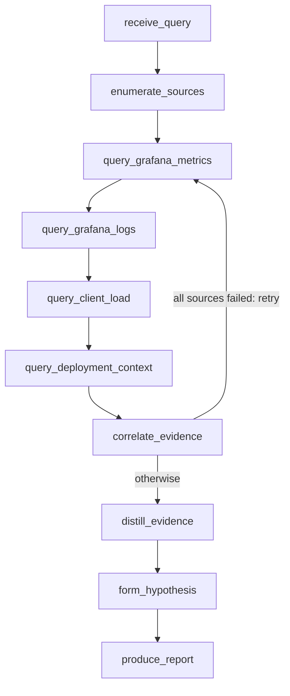

# Leavitt

**Title:** Leavitt: an incident agent that reads the plate, not the sky.

**Tagline / elevator pitch:** A read-only, on-call incident-triage agent. It
reads your observability dashboards one source at a time, finds what broke, and
reports the cause. It can never touch the systems it watches.

---

Leavitt is a read-only observability triage agent that stays correct when its
infrastructure falls apart. It is built on Theodosia, a state-machine runtime
that makes the failure mode of a confused agent a visible, incomplete trace
instead of a silent wrong answer.

## Inspiration

The TrueFoundry "Resilient Agents" challenge asks a direct question: how does
your agent behave when an MCP server starts erroring, or the LLM browns out?
Most agents answer badly. Under chaos they do the dangerous thing, they keep
going and emit a confident, plausible, wrong conclusion. For an on-call agent
reading dashboards at 3am, a silent false positive is worse than no answer.

We wanted an agent whose worst case is honest. Not "it never fails," but "when
it fails, it fails loudly and never claims a resolution it cannot support." That
requires moving the guarantee out of the prompt and into the runtime.

## What it does

You give Leavitt an incident question. It reads four observability sources
through MCP servers, server-side error rate (Prometheus), warning and error
logs (Loki), client-side failure rate (k6 load tests), and current feature-flag
state, correlates them, and produces a triage report. The report's disposition
is constrained by the evidence: `resolved` only with full confidence and a clear
cause, `degraded` when sources were lost, `inconclusive` when nothing usable
came back.

Leavitt cannot act on the systems it observes. It has no shell, no write tool,
no command execution. It reads dashboards and reports.

It ships as a **Hermes agent running NVIDIA Nemotron on Crusoe Cloud managed
inference**: Hermes drives the Leavitt MCP, Nemotron walks the enforced FSM to
the triage report. The agent is Leavitt; Hermes is the outer harness, Theodosia
the inner one.

## How we built it

Leavitt is a Burr state machine mounted as an MCP server by **Theodosia**. An
LLM (Kimi K2.6 via litellm) drives the machine one `step` at a time. Theodosia
validates every transition against the graph, so the model cannot skip the
correlation step to jump to a conclusion, and cannot reach a write action
because the graph has none.

The flow: receive_query, enumerate_sources, four read-only source queries
(metrics, logs, client load, deployment context), correlate_evidence (with a
retry loop on total source failure), distill_evidence, form_hypothesis,
produce_report.

- **Substrate:** the OpenTelemetry Demo (15+ instrumented microservices) with
  `flagd` for chaos injection. We rewrote the demo's Python/Locust load generator
  in **k6** so the stack is Grafana-native end to end, and wired k6's client-side
  metrics back as a Leavitt source. We added Loki to the demo so logs are
  queryable through `mcp-grafana`, which does not read the demo's default
  OpenSearch.
- **Sources as MCP upstreams:** Leavitt never sees the backends. Each query runs
  inside an action through `theodosia.call_upstream`, so every read is a recorded
  ledger entry. Failures are classified `ok` / `error` / `malformed` before they
  reach correlation.
- **Two-tier reasoning:** a deterministic `distill_evidence` step reduces raw
  Prometheus matrices and log dumps to a high-signal digest, as its own recorded
  action, before the reasoning model sees it.

The benchmark runs each `flagd` scenario under clean, single-source-down, and
multi-failure conditions, comparing Leavitt against a baseline that is the same
model with the same data and the same raw tools but no Theodosia layer.

**Composing with the ecosystem.** Because Theodosia mounts Leavitt as a standard
MCP server, other agents drive it without any custom glue. We verified this with
a **Hermes agent (NousResearch) running NVIDIA Nemotron on Crusoe Cloud managed
inference**: Hermes connected to Leavitt as a generic MCP server, and Nemotron
drove the full FSM (`receive_query` to `produce_report`) to the correct root
cause, the cascade detail it returned exists only in the live telemetry, not the
prompt, so it genuinely walked the machine. The agent is Leavitt; Hermes is the
outer harness, Theodosia the inner one, two governance layers on one Nemotron
agent. Separately, Leavitt's LLM calls route through **TrueFoundry's AI Gateway**
(one env switch), so provider failover and retries happen at the gateway while
Theodosia handles data-layer resilience. Same artifact, three sponsors.

**An on-call agent, not a chatbot.** Because the agent is headless and read-only,
it runs unattended. A Hermes cron schedule fires the same investigation on an
interval, and we scope the cron platform to the Leavitt toolset so the scheduled
worker has exactly one capability: calling `step`. It wakes, reads the
dashboards, walks the FSM to a report in the audit trail, and never has a path to
act. That is the agent you can leave running at 3am: its worst case under chaos
is a visible incomplete trace, not a confident wrong page.

## Challenges we ran into

- **RunPod cannot run Docker.** We tried to offload the heavy substrate to a
  RunPod pod and found its pods are unprivileged containers with no Docker
  daemon, so `docker-compose` cannot run there. We verified this by probing
  capabilities over SSH, then moved the substrate local.
- **mcp-grafana speaks Loki, not OpenSearch.** The demo ships logs to OpenSearch,
  which `mcp-grafana` has no tool for. We added Loki and pointed the collector at
  it so the log source was real.
- **Kimi K2.6 is a reasoning model.** Output splits into reasoning and content;
  a small token budget gets consumed by reasoning and returns empty content. Raw
  telemetry made it worse. The `distill_evidence` step and a larger budget fixed
  it.
- **litellm gated tool calling for Together.** litellm's capability map had not
  catalogued Kimi-K2.6's tool support, which Together's API has. We passed the
  parameters through explicitly.

## Accomplishments that we're proud of

Everything runs against real infrastructure with real chaos. No mocked metrics.
The numbers come from real runs against the OpenTelemetry Demo with real `flagd`
failures.

The result that matters: when a source is killed mid-investigation, Leavitt
continues from the remaining telemetry, marks the report `degraded`, records a
recovery event, and still finds the cause, without claiming `resolved`. When
sources return garbage, it declines to conclude rather than hallucinate. The
comparison against the no-Theodosia baseline is in `demo/results_table.md`.

The architecture turns the dangerous failure mode (silent wrong conclusion) into
a safe one (a report marked degraded or inconclusive, with the full read trail).

## What we learned

The honest framing of the inversion: Theodosia guarantees the agent stays inside
the graph and never reaches an invalid state. It does not guarantee a weak model
makes progress, a confused model can stall, but stalling leaves an incomplete
trace you can alarm on, which is a safe failure. The trade is safety for
liveness, and for an unattended triage worker that is the right trade. The
guarantee is only as good as the graph; Theodosia enforces adherence, the graph
author owns correctness.

## What's next for Leavitt

The same read-only observer can watch other agents. A Hermes/Nemotron agent
emits its own telemetry; point Leavitt at it and the read-only triage agent
becomes an on-call observer for an agent fleet, reporting what degraded without
ever acting. The composition we proved (a Nemotron agent driving a Theodosia
FSM, LLM routable through a gateway) generalizes: any Theodosia-mounted workflow
is an enforced, auditable tool any MCP client can drive. Scheduled on-call runs
already work through Hermes cron; next is firing on an alert webhook instead of a
schedule, and widening the source set (traces via the Jaeger datasource, a
latency query for cache-style failures that do not raise error rates).

Built on [Theodosia](https://github.com/msradam/theodosia).
